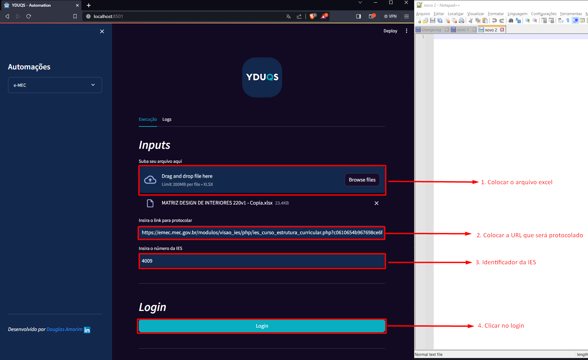

# Sumário
- [Sumário](#sumário)
  - [Pré Requisitos ](#pré-requisitos-)
  - [Preparando o ambiente ](#preparando-o-ambiente-)
  - [Executando a aplicação ](#executando-a-aplicação-)
  - [Acessando a aplicação ](#acessando-a-aplicação-)
  - [Iniciando a aplicação ](#iniciando-a-aplicação-)
  - [Logs ](#logs-)
  - [Suporte ](#suporte-)

## Pré Requisitos <a name="pré-requisitos-"></a>
+ **Python:** versão 3.10.11
+ **SO:** Windows 10
+ **Input:** Arquivo excel respeitando a ordem das colunas
  1. Periodo --------------------> Célula[<span style="color:red">A1</span>]
  2. Disciplina ------------------> Célula[<span style="color:red">B1</span>]
  3. Horas ----------------------> Célula[<span style="color:red">C1</span>]
  4. Ementa ---------------------> Célula[<span style="color:red">D1</span>]
  5. BibliografiaBasica ----------> Célula[<span style="color:red">F1</span>]
  6. BibliografiaComplementar -> Célula[<span style="color:red">E1</span>]


## Preparando o ambiente <a name="preparando-o-ambiente-"></a>
+ Instalando as libs para o funcionamento da aplicação(*Executar o comando no terminal do powershell ou cmd apenas uma **única vez***)
  + **```pip install -r .\requirements.txt```**

## Executando a aplicação <a name="executando-a-aplicação-"></a>
+ Executar o comando no terminal do powershell ou cmd sempre que for usar a aplicação
  + **```python .\setup.py```**

## Acessando a aplicação <a name="acessando-a-aplicação-"></a>
+ Abrir o navegador e colocar o seguinte endereço
  + <a href="http://localhost:8501" target="_blank">http://localhost:8501</a>


## Iniciando a aplicação <a name="iniciando-a-aplicação-"></a>
+ Escolha o navegador


+ Adicionando as camadas de input
  + Arquivo Excel
  + Link para registrar as ementas
  + Código da IES



+ Realizar o login =>**ATENÇÃO**<=
  1. Quando clicar no botão de login, irá abrir o navegador do Chrome nesse endereço


  2. Ao aparecer essa tela, clique em "OK" para fechar o Pop-Up.
  3. O login deverá ser feito em uma outra janela devido a bloqueios de segurança por parte do orgão, portanto aperte a tecla **```CTRL + N```**
  4. Faça o login nesta nova janela e mantenha a outra ainda aberta


  
  5. Feito isso, volte para a aplicação e aperte o botão **Executar**


## Logs <a name="logs-"></a>


## Suporte <a name="suporte-"></a>
